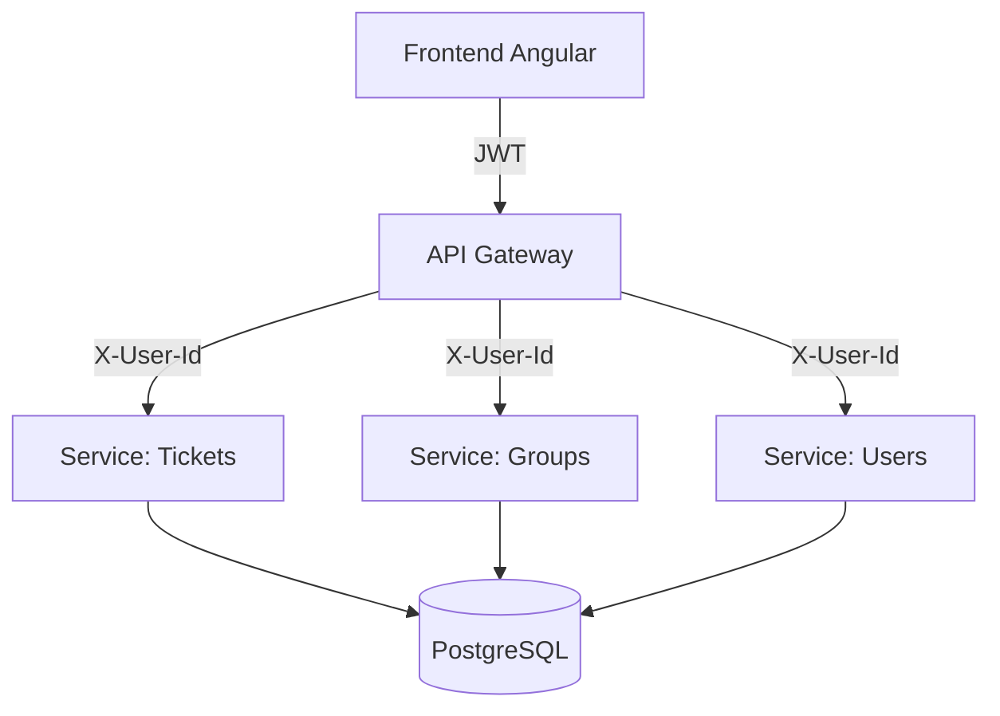

# Resumen de Implementación Técnico

Este documento resume los hitos técnicos logrados en el desarrollo de **SIPNG**, destacando la transición de un monolito a una arquitectura distribuida.

## 🏛️ Evolución Arquitectónica

El proyecto comenzó como un sistema tradicional y evolucionó hacia una infraestructura de **cuatro capas**:

1. **API Gateway**: Actúa como el único punto de entrada, manejando Rate Limiting, CORS y Enrutamiento.
2. **Capa de Microservicios**: Los dominios de Usuarios, Tickets y Grupos se han desacoplado en procesos independientes.
3. **Persistencia**: Uso de PostgreSQL con Supabase, integrando auditoría nativa para garantizar trazabilidad.
4. **Frontend Reactivo**: Una SPA construida con Angular 21 y PrimeNG.

## 🚀 Logros Clave

- **Desacoplamiento Total**: Las responsabilidades están divididas, permitiendo que un fallo en el servicio de tickets no afecte la autenticación de usuarios.
- **Auditoría Extendida**: Cada microservicio registra automáticamente quién hizo qué y cuándo, almacenando los cambios en la tabla `audit_logs`.
- **Métricas de Rendimiento**: El Gateway registra el tiempo de respuesta de cada petición en `api_metrics`.
- **Automatización**: Implementación de scripts de orquestación local y configuraciones de nube (Railway/Vercel).

---

## 🏗️ Diagrama Lógico de Operación

